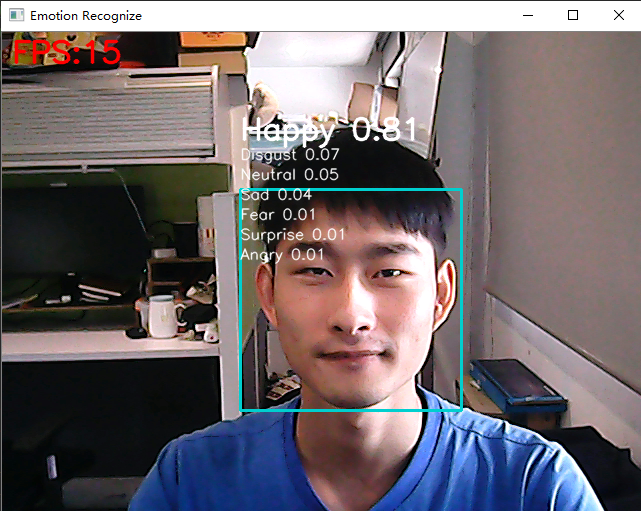
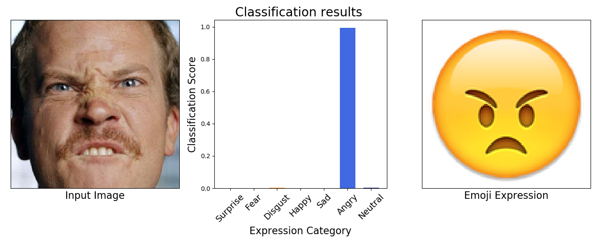
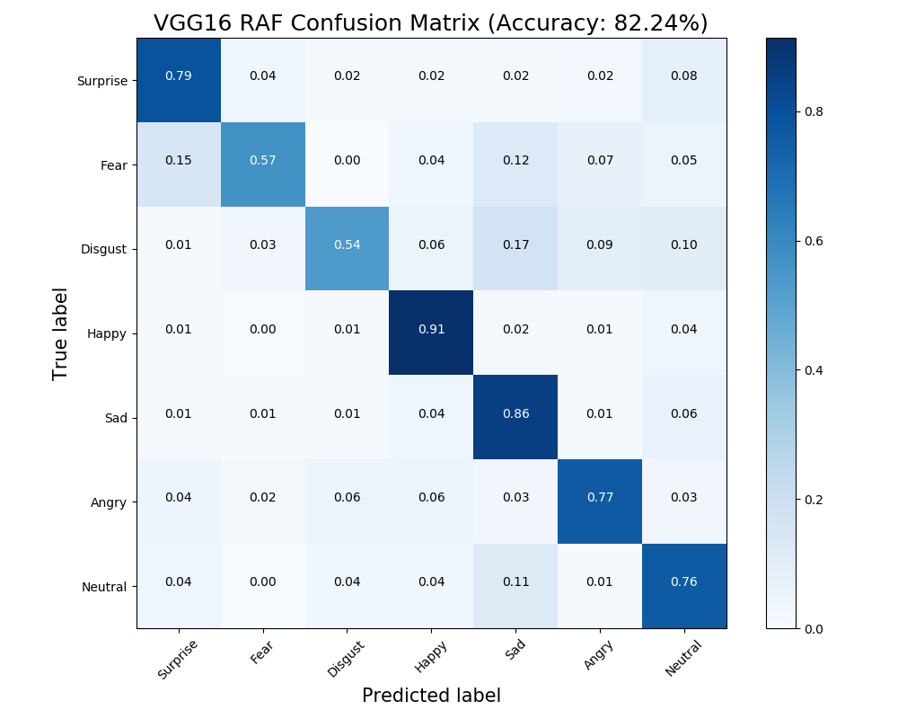

# Face Emotion

[TOC]

## Introduce

This project can recognize 7 emotions (Surprise, Fear, Disgust, Happy, Sad, Angry, Neutral).

- [x] Running in real time on PC.
- [x] Running in real time on Android. (Not released yet)

The code uses the `tensorflow.keras` to train. 

## Environment

​	Ubuntu 16.04

​	Python 3.6

​	TensorFlow 1.12.0

​	OpenCV 3.4.5

## Result

You can see the results in `results`.







## Test

You can download the model I have trained and put it into `trained_models/emotion_models` .
[[Baidu Cloud]](https://pan.baidu.com/s/1qEJaieLaHmn2WKwIvXtnOQ) [code: 49c2]

* Use `src/image_emotion_show.py` to show the recognize result of a single image.
* Use `src/video_emotion_show.py` to display the video or use camera.
* Use `src/evaluate.py` to evaluate the model.

## Train

If you want to train your own model, you should:

​		First, prepare the [dataset](#about dataset) and [pretrain model](#about model).

​		Then, set the parameters in `src/config/train_cfg.py`.

​		Finally, run the `src/train_emotion.py`.

### about dataset

The dataset is **Real-world Affective Faces Database.** 

- Download the dataset by contacting the author from [the website](<http://www.whdeng.cn/raf/model1.html>).
- And put the images of origin dataset catalog `basic/Image/aligned/` into this project catalog `datasets/RAFdb/`.

Or you can use **FER2013** dataset.

### about model

* You can download the pretrain model to fine tune, vgg or mobilenet.
* Then put it into `trained_models/pretrain_models` .

#### VGG16

​	This project uses the ***vgg16 notop*** pretrain model to fine tune, you can download [here](https://github.com/fchollet/deep-learning-models/releases/download/v0.1/vgg16_weights_tf_dim_ordering_tf_kernels_notop.h5).

​	In order to run faster, you can use GlobalAveragePooling2D or one 512-d instead of two 4096-d FC layers in vgg16 model. It could be set in `src/nets/vgg.py`.

#### MobileNet

​	This project uses the ***mobilenetV2 notop*** pretrain model to fine tune, you can download [here](https://github.com/JonathanCMitchell/mobilenet_v2_keras/releases/download/v1.1/mobilenet_v2_weights_tf_dim_ordering_tf_kernels_1.0_128_no_top.h5).

## NOTE

* TFLITE is the model running on Android, you can write a demo by learning the [examples](https://tensorflow.google.cn/lite/examples/).

* If you use MobileNet model, when you load the model, there may be the error:

```shell
	File "/home/zjb/anaconda3/lib/python3.6/site-packages/tensorflow/python/keras/layers/advanced_activations.py", line 309, in __init__
	if max_value is not None and max_value < 0.:
TypeError: '<' not supported between instances of 'dict' and 'float'

```

You can modify the code in
`python3.6/site-packages/tensorflow/python/keras/layers/advanced_activations.py`，
and in line 309, add the following code：

```python
    if isinstance(max_value,dict):
        max_value = max_value['value']
    if isinstance(negative_slope,dict):
        negative_slope = negative_slope['value']
    if isinstance(threshold,dict):
        threshold = threshold['value']
```

## Inspired

This project is heavily inspired by the following:

[Facial-Expression-Recognition.Pytorch](<https://github.com/WuJie1010/Facial-Expression-Recognition.Pytorch>)

[face_classification](<https://github.com/oarriaga/face_classification>)